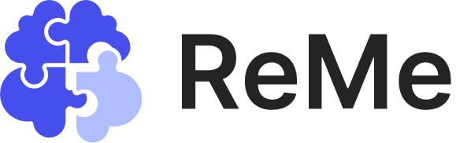
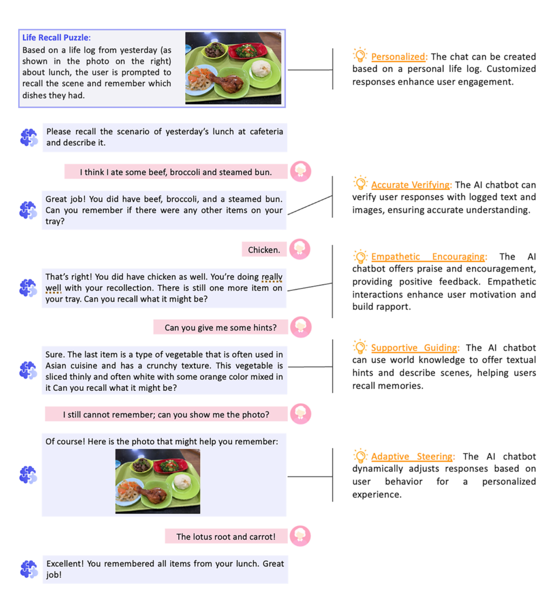
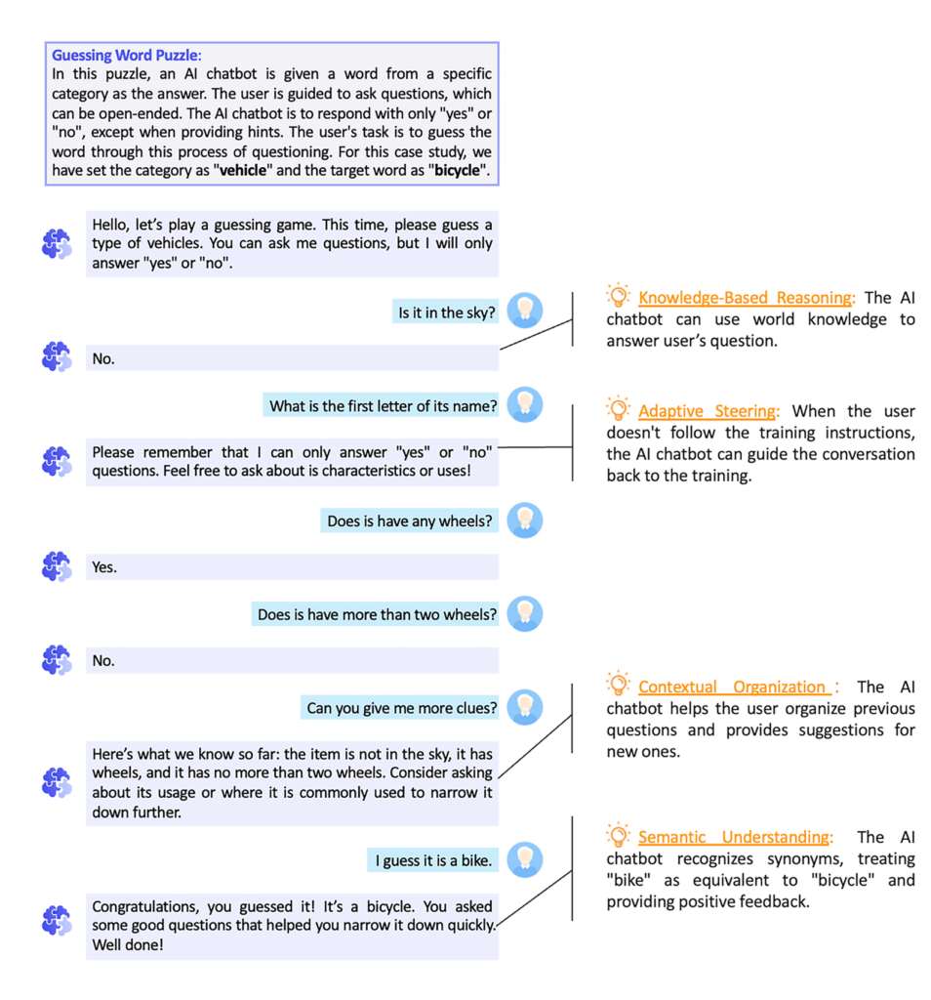

<h1 align="center">
 
ReMe: Personalized Cognitive Training Framework
</h1>

<h4 align="center">
   <a href="https://www.microsoft.com/en-us/research/project/reme/" target="_blank"> 🔍 Project Page</a>  | 
   <a href="#-quick-start" target="">📖 Quick Start</a> | 
   <a href="https://arxiv.org/abs/2410.19733" target="_blank"> 📃 Paper </a>
</h4>


## 🌟 Introduction
<div align="center">
      
</div>

With the emergence of new capabilities in ambient sensing technology and Large Language Models, we were inspired to create **ReMe**, a personalized cognitive training framework designed to create AI chatbots that facilitate personalized cognitive training. It has the potential to be highly beneficial in the area of cognitive health, such as in the prevention and early intervention of Alzheimer’s disease.


## 🚀 Quick start

### 🛠️ setup Backend Service
```
In backend folder:

1. Install the required dependencies
   pip install -r requirements.txt

2. Initialize the database
   python manage.py init_db
   python manage.py seed_db

3. Configure environment variables in `.env` file, follow the `.env.template` file

4. Run flask app for ReMe backend
   python app/run.py

5. Test the API
   python test/api_test.py
```

### 🌐 Setup Frontend Service
```
In frontend folder:
1. Install dependencies using npm
npm install

2. Set .env.development

3. Start the development server
npm run dev
```

More details can be found in the [backend docs](backend/Readme_ReMe_Backend.md) and [frontend docs](frontend/README.md).

## 📱 Cognitive Training Puzzle Demos

<table>
   <tr>
      <th>Training case: Life Recall</th>
      <th>Training case: Word Guess</th>
   </tr>
   <tr>
      <td></td>
      <td></td>
   </tr>
</table>

## 📃 Paper
```
@article{wang2024potential,
  title={The Potential and Value of AI Chatbot in Personalized Cognitive Training},
  author={Wang, Zilong and Chen, Nan and Qiu, Luna K and Yue, Ling and Guo, Geli and Ou, Yang and Jiang, Shiqi and Yang, Yuqing and Qiu, Lili},
  journal={arXiv preprint arXiv:2410.19733},
  year={2024}
}
```


## 🤝 Contributing
We welcome research collaborations on the application of LLM chatbots in the healthcare field, especially in the area of cognitive training. If you are interested in using this framework to explore human-computer interaction, training, and testing methods in various scenarios, please feel free to contact us.

## ⚖️ Disclaimer
ReMe was developed for research and experimental purposes with usability assessment involving only participants without cognitive impairments Further testing and validation are needed before considering its application in commercial or real-world scenarios.

ReMe does not provide medical or clinical opinions and is not designed to replace the role of qualified medical professionals in appropriately identifying, assessing diagnosing or managing medical conditions.

Further details
- [Transparency Document](TRANSPARENCY_DOCUMENT.md)
- [License](LICENSE)
- [SUPPORT](SUPPORT.md)